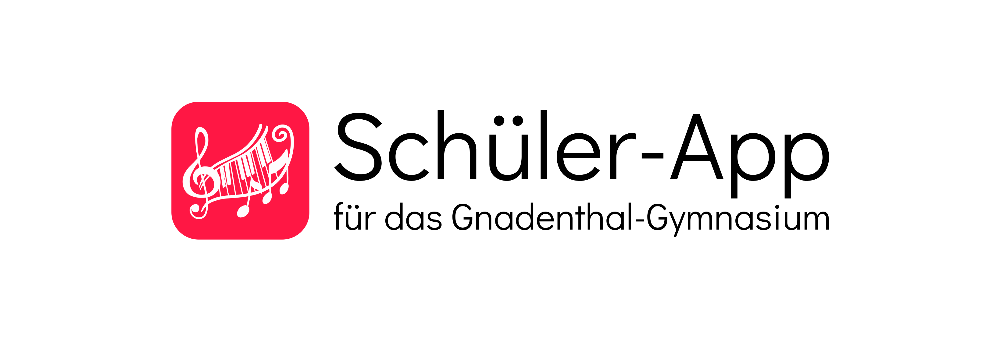

**Deutsch** | [English](README_en.md)

<h1 align="center">
    
</h1>

Vertretungen und Neuigkeiten aus der Schule immer griffbereit! 🎓🏫

Ermöglicht den Zugriff auf den aktuellen Vertretungsplan, die Nachrichten der Schulleitung und einen Blog mit Neuigkeiten aus dem Schulleben (z.B. Veranstaltungen, Ankündigungen, Beiträge).

Verfügbar für Android und iOS:

 

Hinweis: Diese Anwendung ist kein offizielles Angebot der Schule, wurde aber in Absprache mit der Schulleitung entwickelt und veröffentlicht.

## Funktionen 🚀
✅ **Vertretungsplan:**
Zugriff auf den aktuellen Vertretungsplans und die Nachrichten der Schulleitung, wie auf der Webseite. Erweitert um folgende Funktionen:

- Filterung des Vertretungsplans nach Jahrgangsstufe oder Kurs
- Nachschlagen von Lehrerkürzeln durch einfaches Antippen
- Anpassung der Anzahl der angezeigten Tage (2-5)

✅ **Schulleben-Blog:**
Nachrichtenseite mit Beiträgen, Veranstaltungen und Ankündigungen aus dem Schulleben.

✅ **Lehrerkürzel-Übersicht:**
Vollständige Übersicht aller Lehrerkürzel.

✅ **Heller und dunkler Modus:**
Auswahl zwischen hellem und dunklem Modus für eine angenehme Benutzererfahrung zu jeder Tageszeit.

✅ **Feedback und Bug-Meldung:**
Möglichkeit zur Übermittlung von Feedback oder Bug-Meldungen direkt über die App.

✅ **Verfügbare Sprachen:**
Benutzeroberfläche verfügbar in Deutsch (Standard), Englisch und Französisch.

## Support 🚩
Bei Problemen, Bugs, Fragen, Kritik oder Anregungen bitte entweder eine E-Mail an app-support@lukasengel.net schreiben oder das Feedback-Formular in den Einstellungen ausfüllen.

## Lizenz 📜
Der Quellcode steht unter der BSD3-Lizenz öffentlich zur Verfügung. Weitere Informationen finden Sie in der Datei [`LICENSE.md`](LICENSE.md).

## Verwandte Repositories 🔗
- Schüler-App Backend: https://github.com/lukasengel/schueler_app_backend