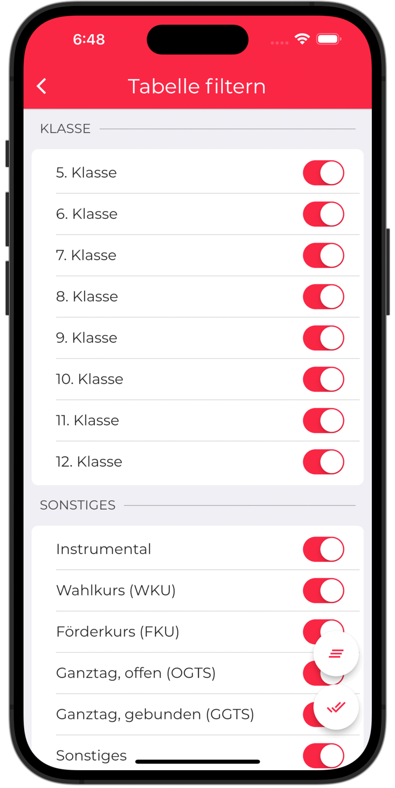

# GG Schüler-App
Schüler-App für das Gnadenthal-Gymnasium Ingolstadt.

Ermöglicht den Zugriff auf den aktuellen Vertretungsplan, die Nachrichten der Schulleitung und ein schwarzes Brett mit Neuigkeiten im Schulleben (z.B. Veranstaltungen, Ankündigungen, Beiträge).
Optional können auch Benachrichtigungen z.B. bei neuen Vertretungen, Neuigkeiten oder Rundnachrichten aktiviert werden.

Verfügbar im Play Store unter: https://play.google.com/store/apps/details?id=de.gnadenthalgymnasium.schueler_app

## Funktionen
- [x] Vertretungsplan, Nachrichten der Schulleitung, Schulleben-Seite
- [x] Nachtmodus/Dunkelmodus
- [x] Anpassung an Plattform (Android/iOS)
- [x] Filtern der Vertretungsplan-Tabelle nach Klassen
- [x] Feedback/Bug-Meldung
- [x] Lehrerkürzel-Übersicht
- [x] Benachrichtigungen (entfallene Stunden, Neuigkeiten, Rundnachrichten)
- [x] Integration von Artikeln in die App
- [x] APNs Integration

## Mitwirkende
- Logo-Gestaltung:  Nika Peskova
- Entwicklung:  Lukas Engel

## Lizenz
Der Quellcode steht unter der MIT-Lizenz öffentlich zur Verfügung. Weitere Informationen unter license.txt.

## Screenshots

## Weitere Repositories
- Schüler-App-Backend: https://github.com/lukasengel/schueler_app_backend
- Schüler-App-Manager: https://github.com/lukasengel/schueler_app_manager
