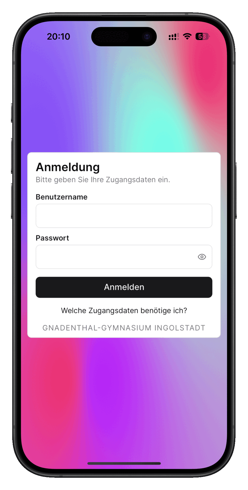

[Deutsch](README.md) | **English**

<h1 align="center">
    
</h1>

Substitutions and news from the school always at hand! 🎓🏫

Provides access to the current substitution plan, news from the principal's office and a blog with news from school life (e.g. events, announcements, posts).

Available for Android and iOS:

 

Note: This application is not an official service by the school, but was developed and published in accordance with the principal.

## Features 🚀
✅ **Substitution Plan:**
Access to the current substitution plan and news from the principal's office, just like on the website. Provides additional features:

- Filtering the substitution plan by grade or course
- Looking up teacher abbreviations by tapping on them
- Adjustment of the number of days displayed (2-5)

✅ **School Life Blog:**
News page with with posts, events and announcements from school life.

✅ **Teacher Abbreviations Overview:**
Complete overview of all teacher abbreviations.

✅ **Light and Dark Mode:**
Choice between light and dark mode for a pleasant user experience at any time of day.

✅ **Feedback or Bug Report :**
Possibility to submit feedback or bug reports directly via the app.

✅ **Available Languages:**
User interface available in German (default), English and French.

## Screenshots 📸

## Support 🚩
If you encounter any problems, bugs, questions, criticism or suggestions, please send an e-mail to app-support@lukasengel.net or fill in the feedback form in the settings.

## License 📜
The source code is publicly available under the BSD3 license. For more information, see [`LICENSE.md`](LICENSE.md).

## Related Repositories 🔗
- Schüler-App Backend: https://github.com/lukasengel/schueler_app_backend