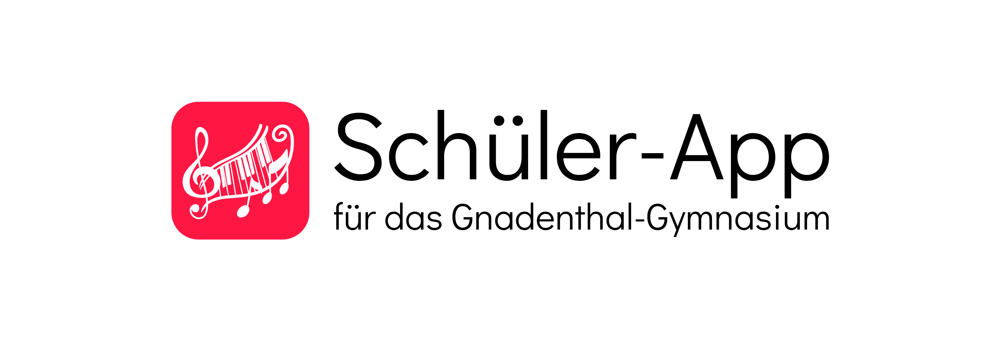

[Deutsch](README.md) | **English**

<h1 align="center">
    
</h1>

Substitutions and news from the school always at hand! 🎓🏫

Provides access to the current substitution plan, news from the principal's office and a blog with news from school life (e.g. events, announcements, posts).

Available for Android and iOS:

 

Note: This application is not an official service by the school, but was developed and published in accordance with the principal.

## Features 🚀
#### Substitution Plan
- Filter the substitution plan by year group or course to see only the information relevant to you.
- Look up teacher abbreviations by simply tapping on them.
- Adjust the desired number of days displayed.
- Read the latest news from the principal's office.

#### School Life Blog
Keep up to date with the latest posts, events and announcements from school life.

#### Teacher Abbreviations Overview
Easy access to a complete overview of all teacher abbreviations.

#### Light and Dark Mode
Choose between light and dark mode for a pleasant reading experience at any time of day.

#### Feedback or Bug Report 
Do you have feedback or have you discovered a bug? Report it to us directly via the app.

#### Available Languages
The user interface is available in German (default), English and French.

## Support 🚩
If you encounter any problems, bugs, questions, criticism or suggestions, please send an e-mail to app-support@lukasengel.net or fill in the feedback form in the settings.

## License 📜
The source code is publicly available under the BSD3 license. For more information, see [`LICENSE.md`](LICENSE.md).

## Related Repositories 🔗
- Schüler-App Backend: https://github.com/lukasengel/schueler_app_backend